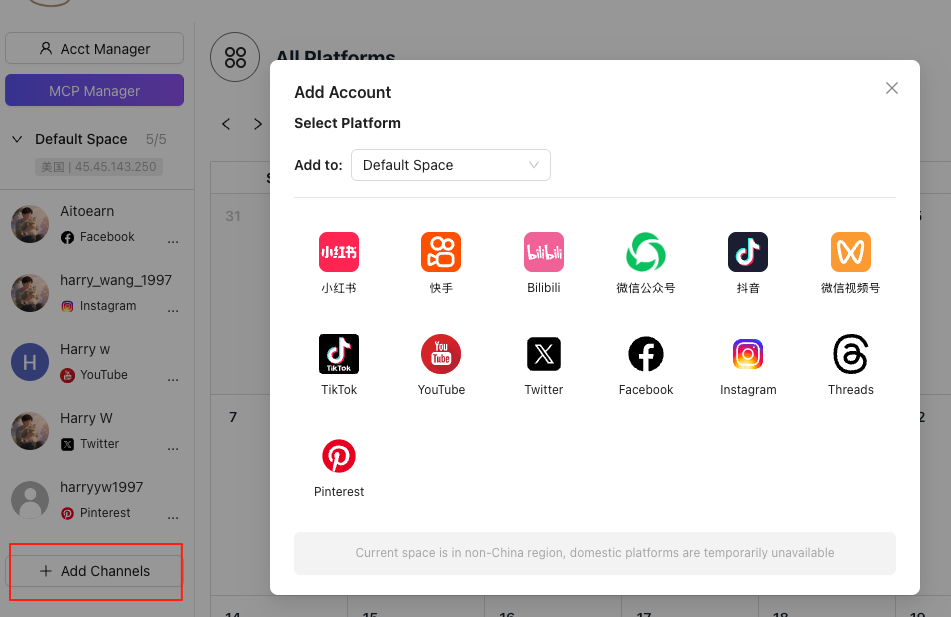
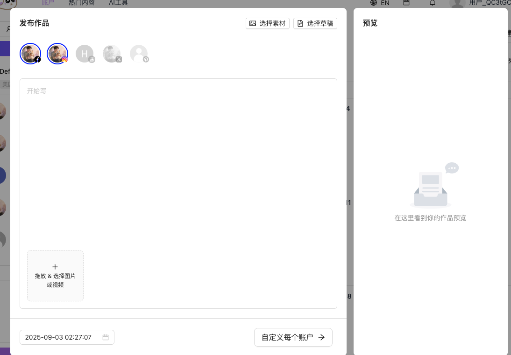

{/* UPDATED_AT */}
_Updated: 2025-09-08_

The first step with Aitoearn is connecting your social channels. Then you can configure a perfect posting schedule, engage your audience, analyze results and even monetize.

Let’s get started!

## Connect your first channel to Aitoearn

- To speed things up, log into the social network first, then open Aitoearn in a separate tab.
- In Aitoearn, click "Add Channels".

- Click the channel you want to connect.
- When the popup appears, click **Start connection**.
- Authorize Aitoearn to access your social account.
- Click **Add to Aitoearn**.
- You’ll see a confirmation in the top‑right once the connection succeeds.

## Spaces

- Each authorized channel belongs to a Space. Think of a space as an environment: desktop, mobile, etc.
- Inside a Space, you can configure device fingerprint details. The most important is the IP address.
- You can create as many Spaces as you need.

## Compose, schedule and publish

- Click **+ New Work** in the top‑right to open the editor (or click the + on the calendar).
- Select the channels you want to publish to.

- Write your text, upload images or video, then choose **Customize for each network** to tailor content per platform.
- Choose to publish now or **set date and time**.
- Finally, click **Publish** to send it.