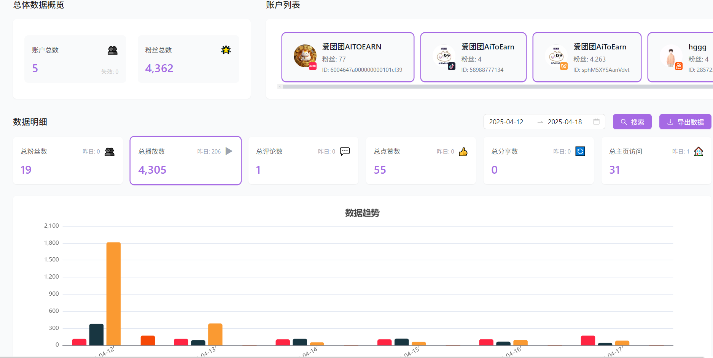

<!-- UPDATED_AT -->
_Updated: 2025-09-08_

# Getting started with Aitoearn analytics

Data‑driven decisions are key to social success. Aitoearn analytics helps you understand performance and optimize strategy.

You can view a cross‑channel overview at a glance or dive into a single platform in depth.

*Aitoearn analytics data center*

## Core features

### Unified analytics dashboard
Our Home view consolidates all channels into one place. It’s the first screen you’ll see when you open the Analyze tab.

Key highlights:
- Real‑time updates
- Multi‑dimensional metrics
- Cross‑platform comparisons
- Visual charts

### Cross‑platform content comparison
Compare how the same content performs across platforms to learn:
- Platform differences (e.g., not great on TikTok but great on YouTube due to different audiences)
- Best publishing times
- Format optimization per platform

## Quick start
1. Open Analyze
   - Log into Aitoearn
   - Click the **Data** tab in the nav
2. Choose your scope
   - All platforms: aggregated performance across channels
   - Single platform: deep‑dive into one network
3. Pick a time range
   - Day, week, month, quarter
   - Compare trends over time
4. Export reports
   - Generate professional reports
   - Export in multiple formats

## Key metrics

### Engagement
- Likes, comments, shares
- Engagement rate
- Reach

### Audience
- Follower growth
- Geo distribution
- Active hours
- Audience profiles

### Content performance
- Top‑performing posts
- Format effectiveness
- Hashtag analysis
