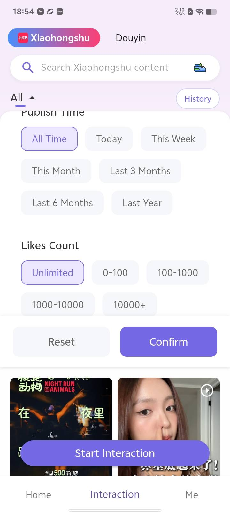
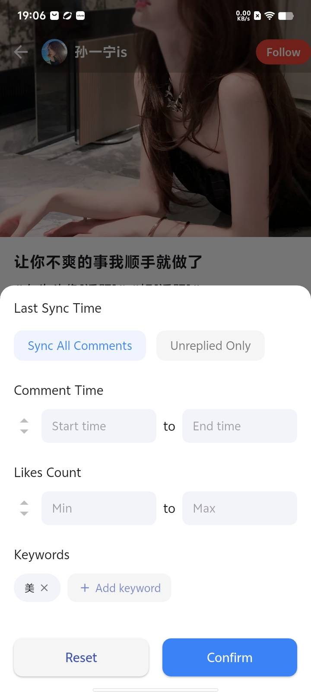

import { UpdatedAt } from '../../../components/UpdatedAt'

<UpdatedAt />

# Getting started with Aitoearn engagement

Replying to social comments can feel overwhelming—but it doesn’t have to be!

Aitoearn uses LLMs and AI to help you like, comment, follow and save with ease.

With sentiment and tagging, you can quickly surface negative comments, questions or order‑related messages right from the dashboard.

⭐️ Some engagement features are available on the [Plus plan](https://aitoearn.ai/en/pricing).

## Quick start

1. In the Aitoearn app, open the **Engage** tab.
2. Select a social channel.
3. Search and choose the content you want to engage with.
4. Use AI to auto‑engage or engage manually.

## Key features

### Unified comment management
- Manage all comments from Xiaohongshu, Douyin, Facebook and Instagram in one place
- Quickly find unreplied comments so you never miss an opportunity

### AI content search
- Brand monitoring: track discussions about your brand in real time and respond fast
- Content discovery: find target posts and topics to engage and expand precisely

#### Showcase

  

    
    
Content search UI

  

  

    
    
Search results

  

  

    
    
Advanced options

  

  

    <video controls width="100%" style={{borderRadius: "8px", border: "1px solid #e5e7eb"}}>
      <source src="../../../photo/contentsearch0.mp4" type="video/mp4" />
      Your browser does not support the video tag.
    </video>
    
Walkthrough

  

### AI comment search
- Find demand signals hidden in comments
- Smart search for phrases like “link?”, “how to buy”
- Convert precisely by replying proactively

#### Showcase

  

    
    
Main UI

  

  

    
    
Filter results

  

  

    <video controls width="100%" style={{borderRadius: "8px", border: "1px solid #e5e7eb"}}>
      <source src="../../../photo/commentfilter2.mp4" type="video/mp4" />
      Your browser does not support the video tag.
    </video>
    
Walkthrough

  

### AI engagement & schedules
- Smart replies powered by GPT‑5, Gemini‑2.5‑Pro, etc.
- Scheduled jobs to auto‑reply to unreplied items daily
