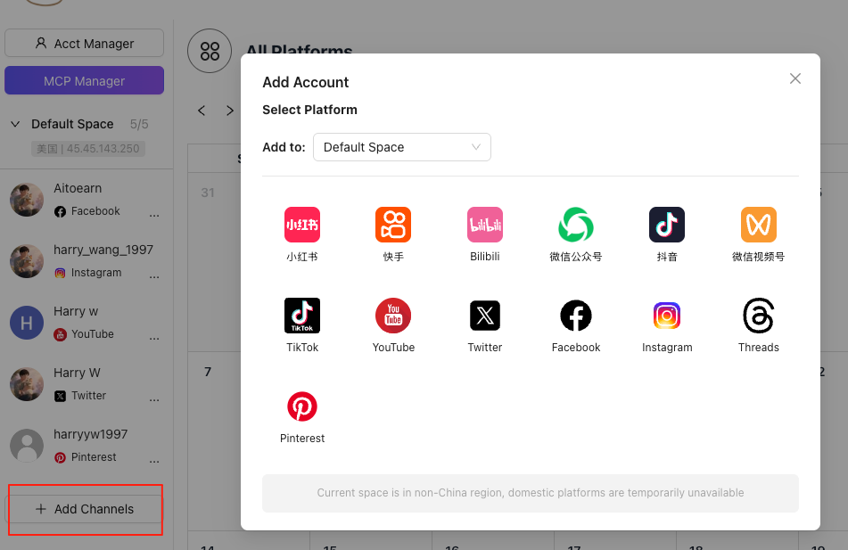
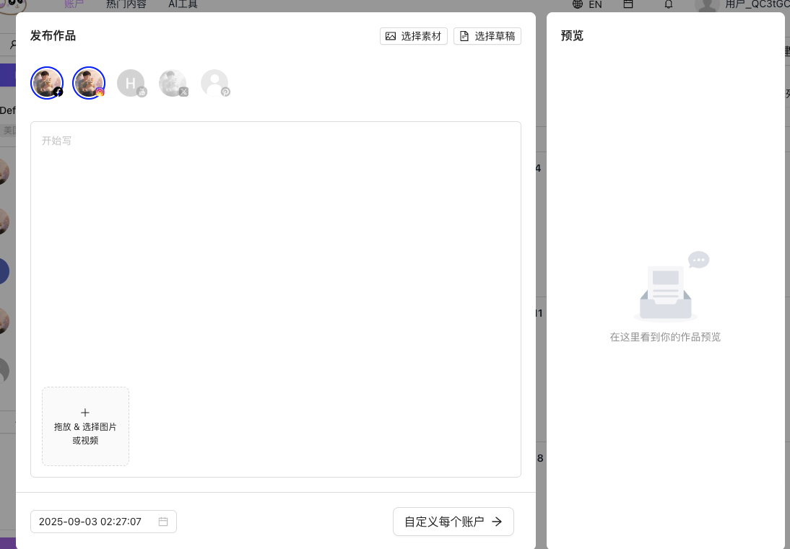

{/* UPDATED_AT */}
_Updated: 2025-09-08_

开始使用 Aitoearn 的第一步是连接您的社交媒体渠道。然后您就能配置完美的发布时间表，与受众互动，分析结果并**实现内容变现**。

让我们开始吧！

## 连接您的第一个渠道到 Aitoearn

- 为了加快连接过程，请先登录您的社交媒体渠道，然后在单独的标签页中打开 Aitoearn。
- 登录 Aitoearn 后，点击"增加频道（Add Channels）"按键。

- 点击您想要连接的频道。
- 当弹出框出现时，点击 **开始连接**。
- 授权 Aitoearn 访问您的社交媒体渠道。
- 点击 **添加到 Aitoearn** 按钮。
- 您将在右上角看到一个对话框，显示连接已成功建立！

## 空间设置

- 每个 Aitoearn 授权频道都属于一个空间，一个空间可以理解为一个环境：包括电脑环境、手机环境。

- 在空间里，您可以设置不同的设备指纹信息，其中最重要的设备信息就是 IP 地址。

- 在 Aitoearn 中，您可以自由创建任意多个空间。

## 撰写、安排和发布内容

- 点击界面右上角的 **+新建作品（+ New Work）** 按钮打开编辑器。
    - 或直接点击日历上的加号
- 选择您要发布到的渠道。

- 撰写文本，上传图片或视频，然后选择 **为每个网络自定义**。您现在可以根据不同社交媒体渠道的需要编辑消息。
- 接下来，您可以选择立即发布，或 **设置日期和时间** 来选择自定义的日期/时间。
- 最后，点击 **发布（publish）** 完成过程。

