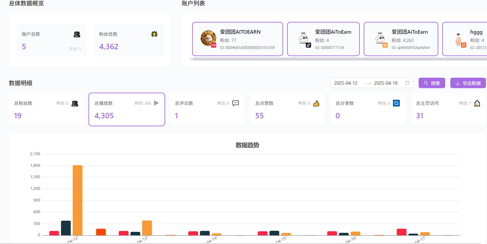

{/* UPDATED_AT */}
_Updated: 2025-09-08_

# Aitoearn 分析功能入门

数据驱动的决策是成功社交媒体营销的关键！Aitoearn 的分析功能让您深入了解内容表现，优化营销策略。

使用 Aitoearn 分析功能，您可以选择一目了然地查看所有社交媒体频道的内容表现，或专注于特定的社交媒体平台进行深度分析。

*Aitoearn 分析数据中心*

## 核心功能概览

### 📊 统一分析仪表板

我们的"主页"将所有频道整合到一个视图中，让您能够获得内容表现的高层次概览。当您登录 Aitoearn 并首次点击"分析"标签时，"主页"就会显示。

**主要特点：**
- 📈 实时数据更新
- 🔍 多维度指标分析
- 📱 跨平台性能对比
- 📊 可视化图表展示

### 🎯 跨平台内容对比

您可以横向比较同一条内容在不同频道的表现。这种对比分析帮您发现：

- **平台差异化表现**：一条内容如果 TikTok 不喜欢，但是 YouTube 会喜欢，这完全有可能，因为这两个频道的用户画像完全不同。
- **最佳发布时机**：不同平台的活跃时段分析
- **内容适配策略**：针对不同平台优化内容格式

## 快速开始指南

1. **进入分析页面**
   - 登录 Aitoearn 账户
   - 点击导航栏中的 **"数据"** 标签

2. **选择分析维度**
   - **全平台视图**：查看所有连接频道的综合表现
   - **单平台深度**：专注分析特定社交媒体平台

3. **自定义时间范围**
   - 选择分析周期（日、周、月、季度）
   - 对比不同时期的表现变化

4. **导出分析报告**
   - 生成专业的数据报告
   - 支持多种格式导出

## 主要分析指标

### 📈 参与度指标
- **点赞数**、**评论数**、**分享数**
- **参与率**：衡量内容与受众的互动程度
- **覆盖率**：内容触达的用户数量

### 👥 受众分析
- **粉丝增长趋势**
- **受众地理分布**
- **活跃时段分析**
- **用户画像洞察**

### 🎯 内容表现
- **最佳表现内容排行**
- **内容类型效果对比**
- **话题标签分析**

